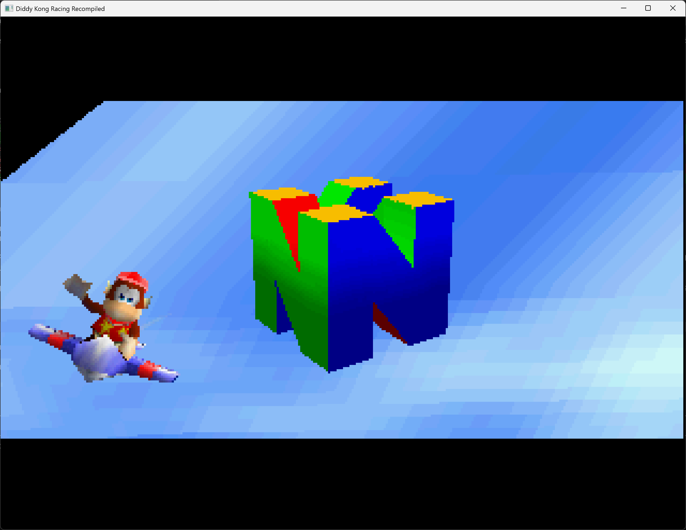

# DKR Recompiled

Static recompilation of **Diddy Kong Racing** (N64, US v1.1) for Windows 11 using [N64Recomp](https://github.com/N64Recomp/N64Recomp).



## Status

- **Build**: Compiles successfully (MSVC, x64, Release)
- **Runtime**: Adventure mode overworld reached — full boot chain, menus, character select, cinematics, hub world
- **Rendering**: All scenes right-side up (antipiracy viewport bypass, single-stage vertex transform)
- **Functions**: 1956 recompiled functions + aspMain RSP microcode
- **Display**: Software framebuffer via SDL2 (320x237, RGBA5551, 60Hz double-buffered), default 2x window scale
- **f3ddkr HLE**: Custom microcode interpreter with full rendering pipeline
- **GUI**: ImGui overlay — menu bar (File/Config/About), settings window (F1), debug overlay (F2)
- **Input**: Keyboard (WASD=analog stick, arrows=D-pad) and Xbox-style gamepad supported (SDL2 GameController API)
- **Audio**: HLE audio pipeline — all 14 aspMain opcodes active, stereo output at 22050 Hz (reverb FX disabled)
- **Saves**: EEPROM 4K implemented (N64ModernRuntime built-in, saves to AppData)
- **RDRAM**: 4GB allocation (all read/write), gzip pointer validation guards
- **RT64**: Removed from build (DKR's f3ddkr microcode not supported)

### Anti-tamper / DRM Bypass (2026-03-18)
The retail ROM has three `IO_READ`-based DRM checks that read N64 hardware registers (SP DMEM, SP IMEM, PIF RAM). In the recomp these map to uninitialized RDRAM offsets, causing all three to fail:
- **`drm_validate_dmem`**: Reads SP_DMEM[0] — when it fails, `gDmemInvalid=TRUE` causes a 10 million iteration busy loop every frame
- **`drm_validate_imem`**: Reads SP_IMEM[0] for CIC_ID — when it fails, `sAntiPiracyTriggered=TRUE` forces START button every frame during gameplay (instant pause)
- **`render_scene` anti-tamper**: Reads PIF_RAM[0x200] — when it fails, all tracks are mirrored

All three bypassed by writing expected values to RDRAM in `on_init_callback`.

### Rendering Pipeline
- **Antipiracy bypass**: DKR checks ROM integrity at boot — recompiled binary triggers the check, flipping the viewport. Bypassed by forcing `gAntiPiracyViewport = FALSE` in RDRAM
- **Single-stage vertex transform**: Decomp-confirmed — no two-stage multiply in f3ddkr RSP; game pre-combines MVP matrices
- **Viewport Y-flip**: N64 positive vscale_y negated for correct software rasterizer orientation
- **Near-plane clipping**: Vertices with w <= 0.1 rejected, screen coords clamped to ±2048, oversized triangles rejected
- **Color combiner**: N64 (A-B)*C+D formula, 1-cycle and 2-cycle modes
- **RDP blender**: Full (P*A + M*B)/(A+B) formula with FORCE_BL support
- **Distance fog**: Per-vertex fog computation via RSP HLE (G_FOG geometry mode)
- **Z-buffer**: Depth test with proper fallback (returns max depth when no z-buffer set)
- **Alpha blending**: Framebuffer read-modify-write with configurable blend modes
- **Alpha test**: Transparent pixels correctly skipped
- **TEXRECT**: Textured rectangles in copy and combiner modes
- **Triangles**: Scanline rasterizer with Z-buffer, scissor clipping
- **Textures**: RGBA16/32, CI4/8, IA4/8/16, I4/8 with TMEM interleaving
- **Fill rect**: Fill/1-cycle/2-cycle modes
- **Render guard**: Re-presents last good frame while f3ddkr is actively rendering to prevent tearing

### Task Execution
- **Synchronous on game thread**: Both GFX and audio RSP tasks run synchronously on the game thread, with SP_COMPLETE and DP_COMPLETE messages sent directly via `osSendMesg` (blocking). This eliminates the external message queue deadlock that occurred when the gfx thread's completion signals couldn't reach the scheduler.

### GUI (ImGui)
- **Menu bar**: File (Quit), Config (Settings), About (Help)
- **Settings window** (F1): General (ROM file selector), Display (window scale 1x-4x), Input, Audio tabs
- **Debug overlay** (F2): FPS graph, display info
- **Help window**: Project info, repository link, credits
- **Theme**: xemu-inspired dark green

### Audio Pipeline
- **aspMain HLE**: Recompiled RSP audio microcode (MIPS to C++) with HLE intercepts for broken dispatch handlers
- **ADPCM HLE**: Fixed dispatch[1]=L_14A4 which entered decode loop without register setup — redirects to L_1428 for proper param read, segment resolve, and state init
- **SETVOL HLE**: Full DKR-specific 5-command envelope setup (vol, target, rate, dry/wet)
- **ENVMIXER HLE**: Linear envelope mixer with per-sample volume ramping, combined gain computation (vol * dry/wet with rounding), and self-consistent 80-byte state save/restore for voice continuation
- **MIXER HLE**: VMULF/VMACF accumulation (dispatch[12] enters at loop body, skipping all setup)
- **INTERLEAVE HLE**: Stereo L/R channel interleaving to output buffer
- **SAVEBUFF/LOADBUFF HLE**: DMA handlers intercepted — dispatch[6] acted as SETBUFF, dispatch[4] used wrong addresses. Both now use SETBUFF params with bounds-checked byte copy.
- **DMEMMOVE HLE**: dispatch[10]=L_1428 was ADPCM setup, not a memory copy — now does proper DMEM-to-DMEM byte copy
- **SEGMENT HLE**: Populates segment table at DMEM[0x320]
- **LOADADPCM HLE**: DMA loads codebook from RDRAM to DMEM[0x4C0]
- **SETBUFF HLE**: Writes to both param banks (0x00 and 0x10 offsets)
- **RESAMPLE**: Fixed infinite loop in op=5 handler (setup/body label split)
- **Null task handling**: DKR submits every 3rd audio task with data_size=0 — silently skipped to prevent 1MB garbage DMA
- **Unknown opcode tolerance**: Command buffer gaps with uninitialized RDRAM are skipped instead of aborting the task
- **Scheduler**: Fixed SI message requeue starvation that blocked SP/DP/VI delivery
- **Output**: SDL2 push-mode audio via `SDL_QueueAudio` (AUDIO_S16SYS, stereo, byte-order corrected)

### Controls
| Key | N64 Button | | Key | N64 Button |
|-----|------------|-|-----|------------|
| W/A/S/D | Analog Stick | | Q | L Trigger |
| Return/Space | A | | E | R Trigger |
| LShift | B | | I/K/J/L | C-Up/Down/Left/Right |
| Z | Z Trigger | | Arrows | D-Pad |
| Escape | Start | | | |

Xbox-style gamepads are also supported:
| Gamepad | N64 Button | | Gamepad | N64 Button |
|---------|------------|-|---------|------------|
| A | A | | Left Trigger | Z Trigger |
| X | B | | Right Trigger | R Trigger |
| Start | Start | | Left Stick | Analog Stick |

## Building

### Prerequisites
- Visual Studio 2022 (MSVC toolchain)
- CMake 3.20+
- N64Recomp tool (for regenerating recompiled functions)

### Build
```bash
cd tracking/build
cmake .. -G "Visual Studio 17 2022" -A x64
cmake --build . --config Release
```

### Post-build
SDL2.dll must be copied manually after clean builds:
```powershell
Copy-Item 'build\_deps\sdl2-build\Release\SDL2.dll' 'build\Release\SDL2.dll'
```

## Running

Use the launch script from the project root:
```
run_dkr.bat
run_dkr.bat "path\to\Diddy Kong Racing (U) [!].z64"
```

Or place your ROM as `build/Release/baserom.us.z64` and run the exe directly. You can also select a ROM via the in-game Settings menu (F1 -> General -> Browse).

### ROM Requirements
- Diddy Kong Racing (US) v1.1 (v80)
- SHA1: `6d96743d46f8c0cd0edb0ec5600b003c89b93755`

## Architecture

```
tracking/
  CMakeLists.txt          # Build configuration
  run_dkr.bat             # Launch script
  dkr.recomp.toml         # N64Recomp configuration
  dkr.us.syms.toml        # Symbol definitions (1956 functions)
  include/
    f3ddkr.h              # f3ddkr microcode definitions and state
    menu_gui.h            # ImGui menu system API
  src/
    main.cpp              # Entry point, SDL init, input, audio, game lifecycle
    rt64_render_context.cpp  # Software renderer + ImGui overlay bridge
    f3ddkr.cpp            # f3ddkr HLE implementation (antipiracy bypass, vertex transform)
    menu_gui.cpp          # ImGui menu system (settings, debug, help)
    audio_diag.cpp        # Audio diagnostic wrappers (alAdpcmPull, alLoadParam, etc.)
    stubs.cpp             # Stub functions for unresolved symbols
    register_overlays.cpp # Overlay registration (none for DKR)
  rsp/
    aspMain.cpp           # aspMain audio RSP microcode HLE (all 14 opcodes)
  third_party/
    imgui/                # Dear ImGui (SDL2 + SDLRenderer2 backends)
  lib/
    N64ModernRuntime/     # ultramodern + librecomp runtime
```

## Recent Fixes (2026-03-18)

- **Anti-tamper DRM bypass** — Three IO_READ-based DRM checks bypassed by writing expected values to RDRAM. This was the ROOT CAUSE of the adventure mode freeze (gDmemInvalid busy loop + sAntiPiracyTriggered forced START).
- **Cinematic auto-skip** — MENU_NEWGAME_CINEMATIC (menu 23) auto-completes to avoid threading deadlock in fb_update/osRecvMesg during cutscene playback.
- **Z-buffer depth fix** — `read_zbuf()` returns max depth (0xFFFF) when no z-buffer is set, preventing all pixels from failing depth test.
- **Near-plane clipping** — Tighter near-plane threshold (w > 0.1), screen coord clamping (±2048), and oversized triangle rejection prevent ground-shattering artifacts.
- **Render-during-present guard** — Re-presents last good frame while f3ddkr is actively rendering to prevent tearing.
- **Window scaling** — Default 2x (640x480), dynamically changeable via F1 → Display tab.
- **Missing function diagnostics** — Logs caller ra/r4/r5 for NULL function pointer calls.

## Known Issues

1. **Intermittent crashes**: Thread scheduler race conditions can crash during scene transitions (run_next_thread accessing corrupted thread contexts)
2. **Graphical glitches**: Ground geometry corruption near camera (near-plane clipping artifacts), some texture bleeding, missing polygons
3. **Backface culling disabled**: DKR's default geometry mode and winding convention need verification
4. **NPC dialogue stuck**: Taj "switch vehicle" dialogue doesn't exit properly
5. **Movement in overworld**: Requires WASD (analog stick), arrow keys are D-pad only
6. **SDL2.dll post-build copy fails**: `pwsh.exe` not found in MSVC build environment
7. **Audio FX disabled**: Reverb (alFxPull) disabled via `if(0)` to avoid ALDelay crashes
8. **Some flashing during scene transitions**: Framebuffer alternation visible during level loads

## Credits

Built with [N64Recomp](https://github.com/N64Recomp/N64Recomp) and [N64ModernRuntime](https://github.com/N64Recomp/N64ModernRuntime).
DKR decomp reference: [Diddy-Kong-Racing](https://github.com/DavidSM64/Diddy-Kong-Racing).
