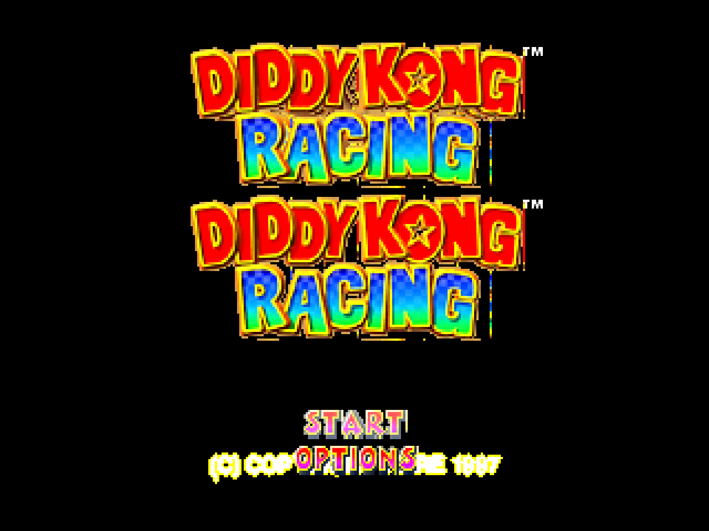

# DKR Recompiled

Static recompilation of **Diddy Kong Racing** (N64, US v1.1) for Windows 11 using [N64Recomp](https://github.com/N64Recomp/N64Recomp).

## Screenshots

**Title Screen** — Full DKR logo with color combiner, TEXRECT rendering, and menu text:



## Status

- **Build**: Compiles successfully (MSVC, x64, Release)
- **Runtime**: Stable, no crashes (30+ second sessions)
- **Functions**: 1956 recompiled functions + aspMain RSP microcode
- **Display**: Software framebuffer via SDL2 (320x237, RGBA5551)
- **f3ddkr HLE**: Custom microcode interpreter — title screen rendering with full color
- **Audio**: aspMain processes 1 task then stalls (scheduler issue)
- **RT64**: Removed from build (DKR's f3ddkr microcode not supported)

### Rendering Progress
- **Title screen**: Full DKR logo with gradients, menu text (START/OPTIONS), copyright
- **Color combiner**: N64 (A-B)*C+D formula implemented for 1-cycle and 2-cycle modes
- **TEXRECT**: Logo/text rendering via textured rectangles (RGBA32 textures)
- **Sky**: Blue sky renders via textured triangles (RGBA16)
- **Alpha test**: Transparent pixels correctly skipped
- **RGBA32 TMEM interleaving**: Properly splits R,G and B,A across TMEM banks

### f3ddkr HLE Features
- Display list parser with recursive sub-DL support (G_DL, G_DMADL)
- Segment address resolution
- N64 fixed-point matrix loading (s15.16)
- Vertex transform with N64-standard viewport (preserves scale sign)
- Scanline triangle rasterizer with Z-buffer, backface culling, scissor
- Texture loading: LOADBLOCK, LOADTILE, LOADTLUT (with RGBA32 interleaving)
- Texture sampling: RGBA16/32, CI4/8, IA4/8/16, I4/8
- N64 color combiner: (A-B)*C+D formula, 1-cycle and 2-cycle modes
- TEXRECT with copy and 1-cycle modes
- Fill rect in fill/1-cycle/2-cycle modes
- Alpha test (skip alpha=0 pixels)

## Building

### Prerequisites
- Visual Studio 2022 (MSVC toolchain)
- CMake 3.20+
- N64Recomp tool (for regenerating recompiled functions)

### Build
```bash
cd tracking/build
cmake .. -G "Visual Studio 17 2022" -A x64
cmake --build . --config Release
```

### Post-build
SDL2.dll must be copied manually after clean builds:
```powershell
Copy-Item 'build\_deps\sdl2-build\Release\SDL2.dll' 'build\Release\SDL2.dll'
```

## Running

Place your ROM as `build/Release/baserom.us.z64` or pass it as argument:
```
DKRRecompiled.exe "path/to/Diddy Kong Racing (U) [!].z64"
```

Or use the run script:
```powershell
powershell -ExecutionPolicy Bypass -File build\Release\run_dkr.ps1
```

### ROM Requirements
- Diddy Kong Racing (US) v1.1 (v80)
- SHA1: `6d96743d46f8c0cd0edb0ec5600b003c89b93755`

## Architecture

```
tracking/
  CMakeLists.txt          # Build configuration
  dkr.recomp.toml         # N64Recomp configuration
  dkr.us.syms.toml        # Symbol definitions (1956 functions)
  include/
    f3ddkr.h              # f3ddkr microcode definitions and state
  src/
    main.cpp              # Entry point, SDL init, game lifecycle
    rt64_render_context.cpp  # Software renderer + f3ddkr HLE bridge
    f3ddkr.cpp            # f3ddkr HLE implementation (~1900 lines)
    stubs.cpp             # Stub functions for unresolved symbols
    register_overlays.cpp # Overlay registration (none for DKR)
  rsp/
    aspMain.cpp           # aspMain audio RSP microcode HLE
  lib/
    N64ModernRuntime/     # ultramodern + librecomp runtime
```

## Known Issues

1. **Audio stalls after 1 task**: DKR's custom scheduler forwards only 1 VI retrace to the audio thread
2. **SDL2.dll post-build copy fails**: `pwsh.exe` not found in MSVC build environment
3. **Double-buffer artifact**: Title screen logo renders duplicated due to both framebuffers being displayed
4. **No fog/blending**: Distance fog and alpha blending not yet implemented
5. **No controller input**: Game runs but cannot receive button presses yet

## Credits

Built with [N64Recomp](https://github.com/N64Recomp/N64Recomp) and [N64ModernRuntime](https://github.com/N64Recomp/N64ModernRuntime).
DKR decomp reference: [Diddy-Kong-Racing](https://github.com/DavidSM64/Diddy-Kong-Racing).
