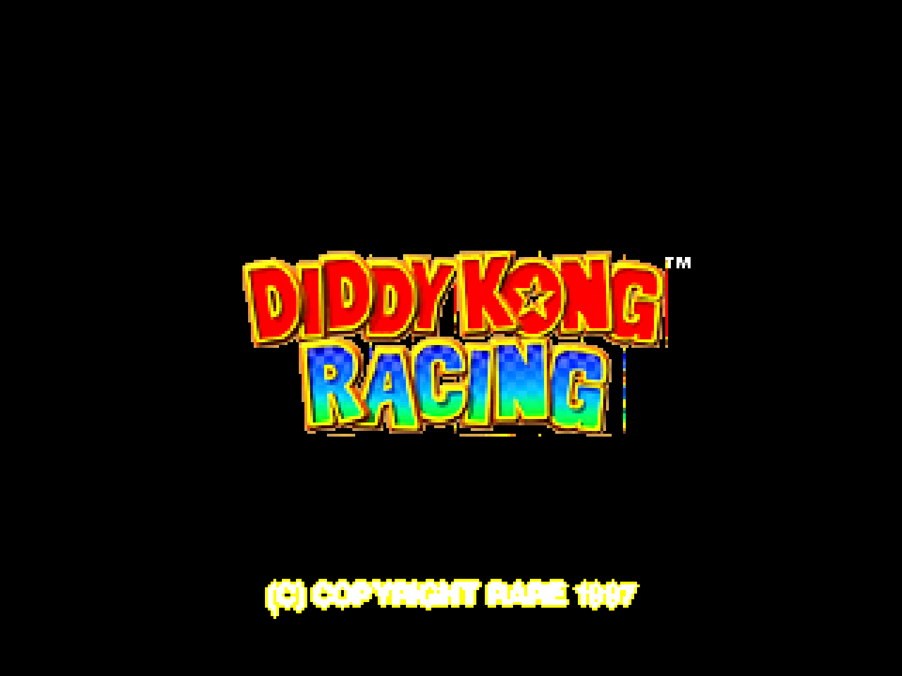

# DKR Recompiled

Static recompilation of **Diddy Kong Racing** (N64, US v1.1) for Windows 11 using [N64Recomp](https://github.com/N64Recomp/N64Recomp).



## Status

- **Build**: Compiles successfully (MSVC, x64, Release)
- **Runtime**: Stable — boots to title screen and menus
- **Functions**: 1956 recompiled functions + aspMain RSP microcode
- **Display**: Software framebuffer via SDL2 (320x237, RGBA5551, 60Hz double-buffered)
- **f3ddkr HLE**: Custom microcode interpreter with full rendering pipeline
- **Input**: Keyboard and Xbox-style gamepad supported (SDL2 GameController API)
- **Audio**: Full HLE audio pipeline — all 14 aspMain opcodes active, sustained full-scale stereo output at 22050 Hz
- **RT64**: Removed from build (DKR's f3ddkr microcode not supported)

### Rendering Pipeline
- **Color combiner**: N64 (A-B)*C+D formula, 1-cycle and 2-cycle modes
- **RDP blender**: Full (P*A + M*B)/(A+B) formula with FORCE_BL support
- **Distance fog**: Per-vertex fog computation via RSP HLE (G_FOG geometry mode)
- **Alpha blending**: Framebuffer read-modify-write with configurable blend modes
- **Alpha test**: Transparent pixels correctly skipped
- **TEXRECT**: Textured rectangles in copy and combiner modes
- **Triangles**: Scanline rasterizer with Z-buffer, backface culling, scissor clipping
- **Textures**: RGBA16/32, CI4/8, IA4/8/16, I4/8 with TMEM interleaving
- **Fill rect**: Fill/1-cycle/2-cycle modes

### Audio Pipeline
- **aspMain HLE**: Recompiled RSP audio microcode (MIPS to C++) with HLE intercepts for broken dispatch handlers
- **ADPCM HLE**: Fixed dispatch[1]=L_14A4 which entered decode loop without register setup — redirects to L_1428 for proper param read, segment resolve, and state init
- **SETVOL HLE**: Full DKR-specific 5-command envelope setup (vol, target, rate, dry/wet)
- **ENVMIXER HLE**: Linear envelope mixer with per-sample volume ramping, combined gain computation (vol * dry/wet with rounding), and self-consistent 80-byte state save/restore for voice continuation
- **MIXER HLE**: VMULF/VMACF accumulation (dispatch[12] enters at loop body, skipping all setup)
- **INTERLEAVE HLE**: Stereo L/R channel interleaving to output buffer
- **SAVEBUFF/LOADBUFF HLE**: DMA handlers intercepted — dispatch[6] acted as SETBUFF, dispatch[4] used wrong addresses. Both now use SETBUFF params with bounds-checked byte copy.
- **DMEMMOVE HLE**: dispatch[10]=L_1428 was ADPCM setup, not a memory copy — now does proper DMEM-to-DMEM byte copy
- **SEGMENT HLE**: Populates segment table at DMEM[0x320]
- **LOADADPCM HLE**: DMA loads codebook from RDRAM to DMEM[0x4C0]
- **SETBUFF HLE**: Writes to both param banks (0x00 and 0x10 offsets)
- **RESAMPLE**: Fixed infinite loop in op=5 handler (setup/body label split)
- **Null task handling**: DKR submits every 3rd audio task with data_size=0 — silently skipped to prevent 1MB garbage DMA
- **Unknown opcode tolerance**: Command buffer gaps with uninitialized RDRAM are skipped instead of aborting the task
- **Scheduler**: Fixed SI message requeue starvation that blocked SP/DP/VI delivery
- **Output**: SDL2 push-mode audio via `SDL_QueueAudio` (AUDIO_S16SYS, stereo, byte-order corrected)

### Controls
| Key | N64 Button | | Key | N64 Button |
|-----|------------|-|-----|------------|
| Return/Space | A | | Q | L Trigger |
| LShift | B | | E | R Trigger |
| Z | Z Trigger | | I/K/J/L | C-Up/Down/Left/Right |
| Escape | Start | | Arrows | D-Pad |

Xbox-style gamepads are also supported:
| Gamepad | N64 Button | | Gamepad | N64 Button |
|---------|------------|-|---------|------------|
| A | A | | Left Trigger | Z Trigger |
| X | B | | Right Trigger | R Trigger |
| Start | Start | | Left Stick | Analog Stick |

## Building

### Prerequisites
- Visual Studio 2022 (MSVC toolchain)
- CMake 3.20+
- N64Recomp tool (for regenerating recompiled functions)

### Build
```bash
cd tracking/build
cmake .. -G "Visual Studio 17 2022" -A x64
cmake --build . --config Release
```

### Post-build
SDL2.dll must be copied manually after clean builds:
```powershell
Copy-Item 'build\_deps\sdl2-build\Release\SDL2.dll' 'build\Release\SDL2.dll'
```

## Running

Place your ROM as `build/Release/baserom.us.z64` or pass it as argument:
```
DKRRecompiled.exe "path/to/Diddy Kong Racing (U) [!].z64"
```

Or use the run script:
```powershell
powershell -ExecutionPolicy Bypass -File build\Release\run_dkr.ps1
```

### ROM Requirements
- Diddy Kong Racing (US) v1.1 (v80)
- SHA1: `6d96743d46f8c0cd0edb0ec5600b003c89b93755`

## Architecture

```
tracking/
  CMakeLists.txt          # Build configuration
  dkr.recomp.toml         # N64Recomp configuration
  dkr.us.syms.toml        # Symbol definitions (1956 functions)
  include/
    f3ddkr.h              # f3ddkr microcode definitions and state
  src/
    main.cpp              # Entry point, SDL init, input, audio, game lifecycle
    rt64_render_context.cpp  # Software renderer + f3ddkr HLE bridge
    f3ddkr.cpp            # f3ddkr HLE implementation
    audio_diag.cpp        # Audio diagnostic wrappers (alAdpcmPull, alLoadParam, etc.)
    stubs.cpp             # Stub functions for unresolved symbols
    register_overlays.cpp # Overlay registration (none for DKR)
  rsp/
    aspMain.cpp           # aspMain audio RSP microcode HLE (all 14 opcodes)
  lib/
    N64ModernRuntime/     # ultramodern + librecomp runtime
```

## Known Issues

1. **Menu navigation crash**: Selecting menu items can cause visual corruption and crash
2. **SDL2.dll post-build copy fails**: `pwsh.exe` not found in MSVC build environment
3. **No save support**: Controller Pak functions return NOPACK (EEPROM saves work)
4. **Rare logo washout**: Logo occasionally fades from crisp to washed out before menu

## Credits

Built with [N64Recomp](https://github.com/N64Recomp/N64Recomp) and [N64ModernRuntime](https://github.com/N64Recomp/N64ModernRuntime).
DKR decomp reference: [Diddy-Kong-Racing](https://github.com/DavidSM64/Diddy-Kong-Racing).
